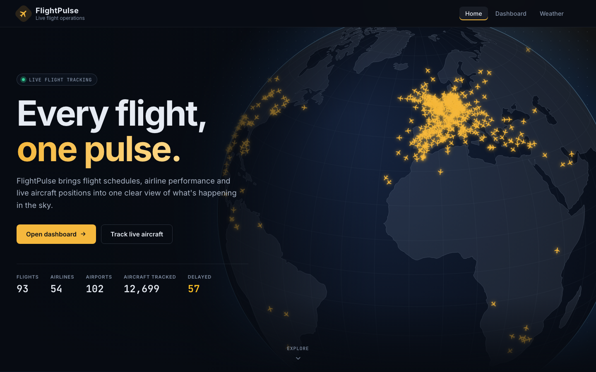
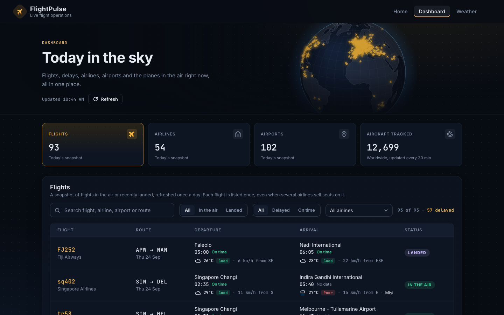
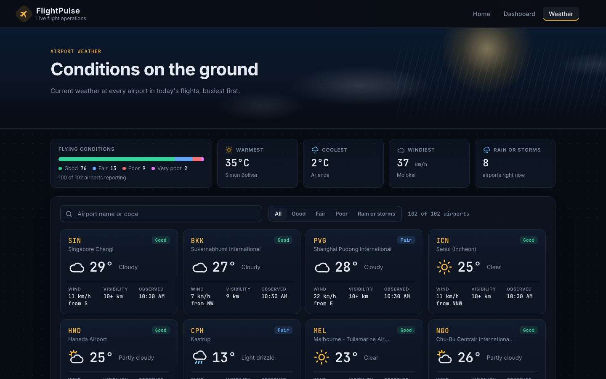
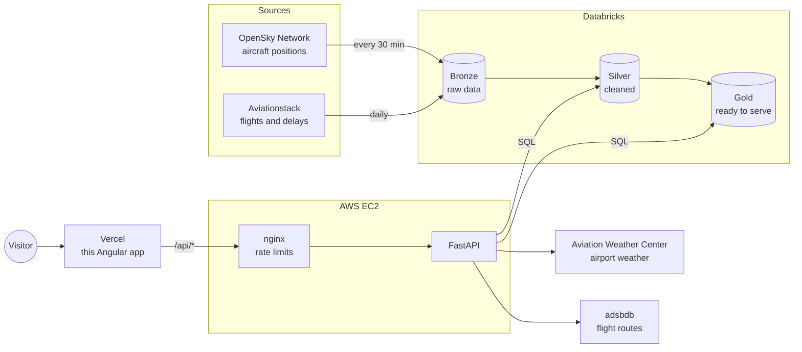

# FlightPulse

**Live flight tracking, delays and airport weather in one view.**

FlightPulse follows thousands of aircraft around the world on a live 3D globe, shows which flights are running late, and reports the weather on the ground at the airports they fly between.

**Live site:** https://flightpulse-frontend.vercel.app



## Features

- **Live globe** of about 500 aircraft in the air, moving at their real speed. Click a plane to follow it and see its route drawn from origin to destination.
- **Dashboard** of the day's flights, airlines and airports, with search, filters, sorting and paging on every table.
- **Delay watch** highlighting the most delayed flights.
- **Airport weather** for every airport in the day's flights: temperature, wind, visibility and flying conditions, with a summary of the warmest, coolest and windiest airports.
- Refreshes itself every 5 minutes; works on phones.

| Dashboard | Airport weather |
|---|---|
|  |  |

## How it works



This repository is the **website**. The rest of the system:

| Part | Where | What it does |
|---|---|---|
| Data pipeline | Databricks | Two scheduled jobs load OpenSky and Aviationstack data through bronze → silver → gold tables, cleaning it and merging codeshare duplicates |
| API | [flightpulse-api](https://github.com/MUMBA-Amos/flightpulse-api), on AWS EC2 | FastAPI service that reads the Databricks tables and adds weather and route lookups, with caching and rate limiting |
| Website | This repo, on Vercel | Angular app; Vercel forwards `/api/*` requests to the API, so the browser only ever talks to one HTTPS address |

## Tech stack

- **Angular 21** with signals, standalone components and lazy-loaded pages
- **d3-geo** and **topojson** to draw the globe on a canvas
- **Vercel** for hosting, deployed automatically on every push to `main`

## Running locally

You need Node.js 20+ and the API running on `http://127.0.0.1:8000` (see [flightpulse-api](https://github.com/MUMBA-Amos/flightpulse-api)).

```bash
npm install
npm start
```

Open http://localhost:4200. In development, `/api/*` requests are forwarded to the local API by `proxy.conf.json`.

## Project layout

```
src/app/
├── pages/        landing (home + globe), dashboard, weather
├── panels/       the dashboard's flights, airlines, airports and aircraft tables
├── services/     API client, weather cache, auto-refresh
├── shared/       nav bar, footer, weather cards, paging, formatting helpers
└── models/       shapes of the API's responses
```

## Deployment

Every push to `main` is built and deployed by Vercel. `vercel.json` sets the build and forwards `/api/*` to the API server.

## Data sources

Aircraft positions from the [OpenSky Network](https://opensky-network.org), flights and delays from [Aviationstack](https://aviationstack.com), airport weather from the [Aviation Weather Center](https://aviationweather.gov) and flight routes from [adsbdb](https://www.adsbdb.com).

Flight details come from a daily sample of up to 200 flights on Aviationstack's free plan, so airline and airport figures are a snapshot, not a complete record. Plane positions are estimated between updates. For information only, not for navigation.
